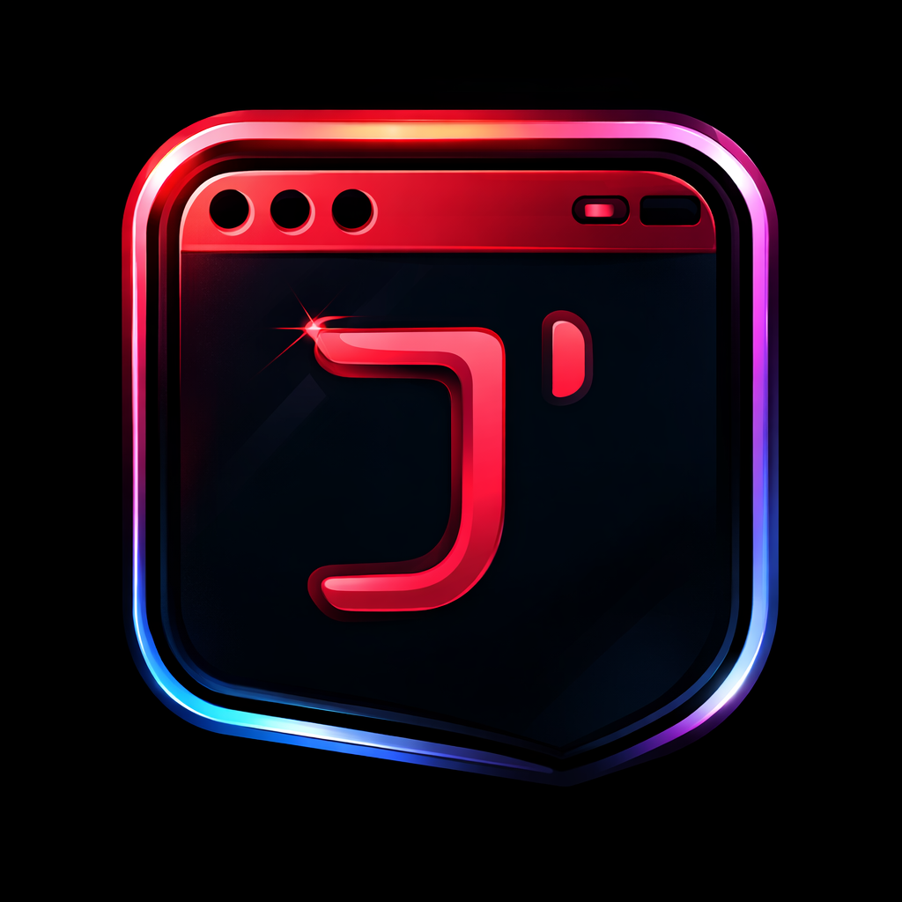

<div align="center">
<a href="https://jayfolio.dev"></a>
</div>

<div align="center">
<h1>jayfolio.dev</h1>
<p>Jay's personal portfolio — software engineer, backend-leaning, currently deep in AI agent orchestration written from scratch in Go.</p>
</div>

<div align="center">

[](https://jayfolio.dev)
[](https://github.com/Dubjay18)
[](https://x.com/d_honouredOne)

</div>

> "Sometimes you gotta run before you can walk." — Tony Stark
>
> That's roughly the philosophy behind the Go agent-orchestration rebuild going on in [`/about`](https://jayfolio.dev/about): skip the framework abstractions, build the harness, context management, and sandboxed execution from first principles, and figure out the rest on the way down.

## About the site

This is the codebase for my personal site — home, blog, gallery, and project archive, backed by Sanity as a headless CMS. It's also where I write about the shift from shipping frontend, to backend, to building multi-agent systems in Go.

Three shifts got me here:

1. **Frontend first, out of necessity** — full Next.js codebases from scratch: component architecture, type contracts, pixel-precise builds.
2. **Pulled toward the backend** — schema design, API contracts, modular architecture, systems that hold under load.
3. **Now building AI agent systems in Go** — a self-directed curriculum on agent orchestration: harness engineering, context management, sandboxed execution, durable multi-agent workflows — built, not imported.

## Tech Stack

- [NextJS][nextjs] - UI framework
- [Vercel][vercel] - Hosting and Deployment
- [Sanity.io][sanity]: Headless CMS and Content Lake
- [TailwindCSS][tailwind] / CSS - Styling and UI
- [Next Themes][nexttheme]: Color Theme
- [React Refractor][reactrefractor]: Syntax Highlighting
- [Framer Motion][framer]: Animation

Toolbox beyond the site itself: TypeScript, Go, Node.js, NestJS, PostgreSQL, Prisma, React, GraphQL, Docker, LLM Orchestration, MCP, System Design.

## Run Project Locally

### Clone Repository

```bash
git clone git@github.com:Dubjay18/portfolioV6.git

cd portfolioV6

npm install
```

- Rename [`.env.example`][env-example] to `.env.local`

### Get Env variables

The minimal `env` variables required to boot this project locally include:

- `Project Id`
- `Dataset`
- `API Version`
- `Access Token`

These variables come from Sanity. To get them, set up your own Sanity instance. Follow the steps below:

### Create a new sanity project

```bash
npm create sanity@latest -- --template clean --create-project "your-project-name" --dataset production
```

- **Create an account**: connects automatically if you already have one, otherwise pick a login provider and follow the prompt.
- **Choose an output path**: hit `Enter` for the default.
- Install dependencies with your preferred package manager.

Then open the studio directory and grab the project id:

```bash
cd your-project-name

code .
```

- Navigate to `sanity.config.ts` and copy the `projectId`.

### Update Env Variables

- Set `NEXT_PUBLIC_SANITY_PROJECT_ID` to the project id you copied
- Set `NEXT_PUBLIC_SANITY_DATASET` to `production` or the dataset name you used
- Set `NEXT_PUBLIC_SANITY_API_VERSION` to the current date in **YYYY-MM-DD** format, or leave as is
- For an access token, visit [sanity.io/manage][sanity-manage] → **project name** → **API** → **Token**, generate one, and set `NEXT_PUBLIC_SANITY_ACCESS_TOKEN`

> [!Warning]
> If you don't want to use a token, comment it out in [`lib/env.api.ts`][env-api] or it will throw errors.

- Run `npm run dev` and visit [http://localhost:3000][localhost].

By default the UI will be blank. Add content by visiting the studio at [http://localhost:3000/studio][localhost-studio].

## Build

```bash
npm run build
```

### Important files and folders

| File(s)                                        | Description                                     |
| ----------------------------------------------- | ----------------------------------------------- |
| [`sanity.config.ts`](sanity.config.ts)         | Config file for Sanity Studio                   |
| [`sanity.client.ts`](lib/sanity.client.ts)     | Config file for Sanity CLI                      |
| [`studio`](./app/studio/[[...index]]/page.tsx) | Where Sanity Studio is mounted                  |
| [`schemas`](./schemas)                         | Where Sanity Studio gets its content types from |
| [`sanity.query.ts`](./lib/sanity.query.ts)     | Groq query for Sanity Schema data               |
| [`app/about/page.tsx`](./app/about/page.tsx)   | The "how I got here" story                      |

## Elsewhere

- GitHub: [Dubjay18][github]
- X: [@d_honouredOne][x]
- LinkedIn: [dubjay][linkedin]
- Medium: [@jejeniyi7][medium]

## License & Usage

This portfolio is MIT-licensed — use it as inspiration, or copy the whole thing (minus my personal content). If you do, a link back to [jayfolio.dev][site] in the footer is appreciated.

<!-- Link Refs -->

[nextjs]: https://nextjs.org
[vercel]: https://vercel.com
[sanity]: https://sanity.io
[tailwind]: https://tailwindcss.com
[nexttheme]: https://github.com/pacocoursey/next-themes
[reactrefractor]: https://github.com/rexxars/react-refractor
[framer]: https://www.framer.com/motion/
[site]: https://jayfolio.dev
[github]: https://github.com/Dubjay18
[x]: https://x.com/d_honouredOne
[linkedin]: https://linkedin.com/in/dubjay
[medium]: https://medium.com/@jejeniyi7
[env-example]: https://github.com/Dubjay18/portfolioV6/blob/main/.env.example
[localhost]: http://localhost:3000
[localhost-studio]: http://localhost:3000/studio
[env-api]: https://github.com/Dubjay18/portfolioV6/blob/main/lib/env.api.ts
[sanity-manage]: https://sanity.io/manage
</content>
